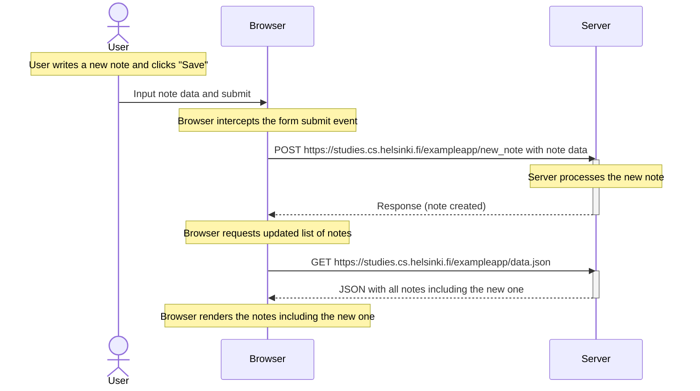

Tehtävä 0.4:

```mermaid
sequenceDiagram
    actor User
    participant Browser
    participant Server

    Note over User: User writes a new note and clicks "Save"
    User->>Browser: Input note data and submit

    Note over Browser: Browser intercepts the form submit event
    Browser->>Server: POST https://studies.cs.helsinki.fi/exampleapp/new_note with note data
    activate Server
    Note over Server: Server processes the new note
    Server-->>Browser: Response (note created)
    deactivate Server

    Note over Browser: Browser requests updated list of notes
    Browser->>Server: GET https://studies.cs.helsinki.fi/exampleapp/data.json
    activate Server
    Server-->>Browser: JSON with all notes including the new one
    deactivate Server

    Note over Browser: Browser renders the notes including the new one
```
