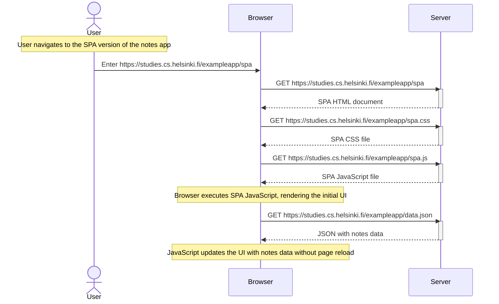

Tehtävä 0.5:

```mermaid
sequenceDiagram
    actor User
    participant Browser
    participant Server

    Note over User: User navigates to the SPA version of the notes app
    User->>Browser: Enter https://studies.cs.helsinki.fi/exampleapp/spa
    Browser->>Server: GET https://studies.cs.helsinki.fi/exampleapp/spa
    activate Server
    Server-->>Browser: SPA HTML document
    deactivate Server

    Browser->>Server: GET https://studies.cs.helsinki.fi/exampleapp/spa.css
    activate Server
    Server-->>Browser: SPA CSS file
    deactivate Server

    Browser->>Server: GET https://studies.cs.helsinki.fi/exampleapp/spa.js
    activate Server
    Server-->>Browser: SPA JavaScript file
    deactivate Server

    Note over Browser: Browser executes SPA JavaScript, rendering the initial UI
    Browser->>Server: GET https://studies.cs.helsinki.fi/exampleapp/data.json
    activate Server
    Server-->>Browser: JSON with notes data
    deactivate Server

    Note over Browser: JavaScript updates the UI with notes data without page reload
```
