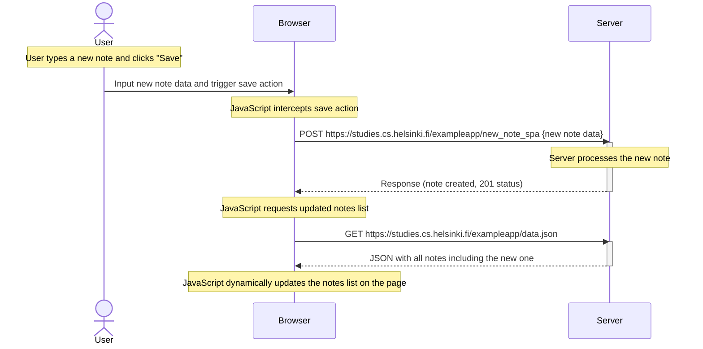

Tehtävä 0.6:

```mermaid
sequenceDiagram
    actor User
    participant Browser
    participant Server

    Note over User: User types a new note and clicks "Save"
    User->>Browser: Input new note data and trigger save action

    Note over Browser: JavaScript intercepts save action
    Browser->>Server: POST https://studies.cs.helsinki.fi/exampleapp/new_note_spa {new note data}
    activate Server
    Note over Server: Server processes the new note
    Server-->>Browser: Response (note created, 201 status)
    deactivate Server

    Note over Browser: JavaScript requests updated notes list
    Browser->>Server: GET https://studies.cs.helsinki.fi/exampleapp/data.json
    activate Server
    Server-->>Browser: JSON with all notes including the new one
    deactivate Server

    Note over Browser: JavaScript dynamically updates the notes list on the page
```
